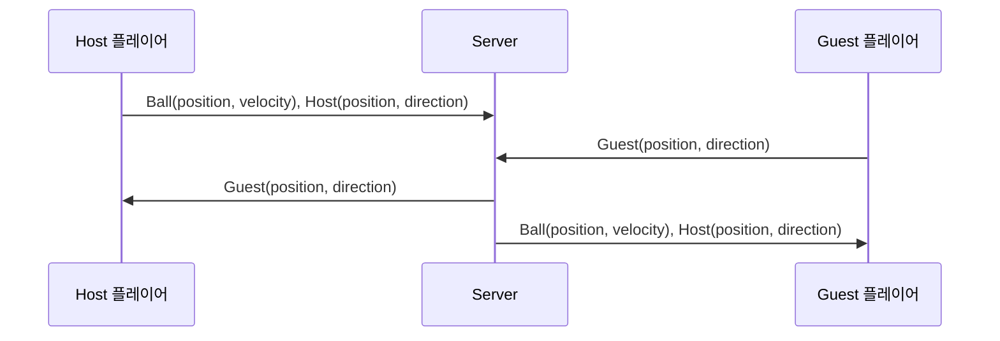

# 피카츄 배구 모바일/온라인 WS Server

 WebSocket 으로 두 게이머간의 실시간 position, direction 및 배구공(몬스터볼)의 position, velocity를 동기화하여 **물리적으로 떨어져있는 두 플레이어가 같은 화면**을 보고 게임을 할 수 있도록 합니다.
더 나아가 게임 방 및 게임 입장 및 거절 등의 방 관리도 지원합니다.

## Demo Video(Youtube)

## Host & Guest

Host의 공의 위치, 속도에 Guest가 맞추도록 설계되어있다.
Guest는 자신의 플레이어 위치와 방향만 Host에게 전송한다.

## Message Sheet

메시지 기반으로 서버에게 요청하면, type에 맞는 동작을 수행해준다.

| 메시지 타입 (`type`) | 동작 | 처리 함수 | 설명 |
|----------------|------------------|----------------|----------------------------------|
| `makeRoom` | 방 만들기 | `handleMakeRoom` | 새로운 방을 생성하고 소켓을 등록 |
| `outRoom` | 방 나가기 | `handleOutRoom` | 해당 소켓을 방에서 제거 |
| `enterRoom` | 방 입장 | `handleEnterRoom` | 사용자를 특정 방에 입장 처리 |
| `permission` | 권한 설정 | `handlePermission` | 특정 사용자의 권한 변경 |
| `getRoom` | 방 목록 조회 | `handleGetRoom` | 현재 존재하는 방 목록 반환 |
| `point` | 특정 지점 데이터 처리 | `handlePoint` | 특정 좌표 또는 포인트 데이터 처리 |
| 기타 메시지 | 기본 메시지 처리 | `handleMessage` | 특정 방의 사용자들에게 메시지 전달 |
| 소켓 연결 종료 | 연결 해제 시 처리 | `whenClose` | 소켓 연결이 종료될 때 처리 |

## Why WebSocket?

`HTTP` 가 아닌 `WebSocket`  사용한 이유

> 실시간성/양방향성 달성을 위해서 사용

| 구분 | WebSocket | HTTP |
|------|----------|------|
| **프로토콜** | ws:// 또는 wss:// | http:// 또는 https:// |
| **통신 방식** | **양방향(Full-Duplex)** | **단방향(Half-Duplex)** |
| **연결 유지** | 연결을 지속적으로 유지 (Persistent Connection) | 요청-응답 후 연결 종료 (Stateless) |
| **데이터 교환** | 클라이언트와 서버가 자유롭게 데이터 송수신 가능 | 클라이언트가 요청하면 서버가 응답하는 방식 |
| **속도** | 빠름 (연결 유지로 인해 Overhead 적음) | 느림 (매 요청마다 새로운 연결 생성) |
| **헤더 크기** | 초기 핸드셰이크 이후 작은 헤더 사용 | 매 요청마다 헤더 포함 (Overhead 큼) |
| **사용 사례** | 실시간 채팅, 게임, 주식 데이터, IoT | 웹페이지 요청, REST API, 파일 다운로드 |
| **서버 푸시** | 가능 (서버가 클라이언트에 직접 데이터 전송) | 불가능 (클라이언트가 요청해야 데이터 응답 가능) |
| **프로토콜 레벨** | TCP 기반의 독립된 프로토콜 | HTTP 기반의 요청-응답 프로토콜 |
| **보안** | wss:// 사용 시 보안 적용 가능 | https:// 사용 시 TLS 적용 가능 |

 **WebSocket**은 서버와 클라이언트 간 **지속적인 연결**을 유지하면서 **양방향**으로 데이터를 빠르게 주고받을 수 있어 **실시간 애플리케이션**에 적합
 
 **HTTP**는 클라이언트가 요청할 때만 서버가 응답하는 구조로, 일반적인 웹사이트나 API 통신에 적합

## Link
[User Data Server Code Repository](https://github.com/Sam-Ryong/pika_server_nodejs)
[Flutter Client Code Repository](https://github.com/Sam-Ryong/pika_client_flutter)
