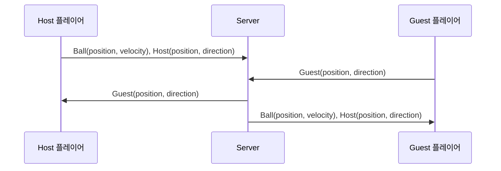

# **피카츄 배구 모바일/온라인 WebSocket 서버**

WebSocket을 이용하여 두 명의 게이머가 실시간으로 **플레이어의 위치(position), 방향(direction), 배구공(몬스터볼)의 위치(position) 및 속도(velocity)** 를 동기화함으로써 **물리적으로 떨어져 있는 두 플레이어가 동일한 화면을 보며 게임을 즐길 수 있도록 구현**합니다. 또한, **게임 방 생성 및 관리(입장, 거절 등)** 기능도 제공합니다.

---

## **🛠 사용 기술**

 

## **🎮 Demo Video (YouTube)**

---

## **🖧 Host & Guest 동기화 구조**

- **Host**의 공(ball) 위치 및 속도에 맞춰 **Guest**가 동기화되도록 설계되어 있음.
- **Guest**는 자신의 플레이어 위치 및 방향만 Host에게 전송함.
- **서버는 Host와 Guest 간의 데이터 흐름을 관리**하며 실시간 동기화를 수행함.

---

## **📩 WebSocket 메시지 프로토콜 (Message Sheet)**

서버는 클라이언트로부터 메시지를 수신하고, `type` 값에 따라 적절한 동작을 수행합니다.

| 메시지 타입 (`type`) | 동작           | 처리 함수              | 설명                  |
| --------------- | ------------ | ------------------ | ------------------- |
| `makeRoom`      | 방 만들기        | `handleMakeRoom`   | 새로운 방을 생성하고 소켓을 등록  |
| `outRoom`       | 방 나가기        | `handleOutRoom`    | 해당 소켓을 방에서 제거       |
| `enterRoom`     | 방 입장         | `handleEnterRoom`  | 사용자를 특정 방에 입장 처리    |
| `permission`    | 권한 설정        | `handlePermission` | 특정 사용자의 권한 변경       |
| `getRoom`       | 방 목록 조회      | `handleGetRoom`    | 현재 존재하는 방 목록 반환     |
| `point`         | 특정 지점 데이터 처리 | `handlePoint`      | 특정 좌표 또는 포인트 데이터 처리 |
| 기타 메시지          | 기본 메시지 처리    | `handleMessage`    | 특정 방의 사용자들에게 메시지 전달 |
| 소켓 연결 종료        | 연결 해제 시 처리   | `whenClose`        | 소켓 연결이 종료될 때 처리     |

---

## **🕸️ WebSocket을 사용하는 이유**

HTTP가 아닌 WebSocket을 사용한 이유는 **실시간성**과 **양방향 통신**을 달성하기 위함입니다.

| 구분          | WebSocket                        | HTTP                       |
| ----------- | -------------------------------- | -------------------------- |
| **프로토콜**    | ws\:// 또는 wss\://                | http\:// 또는 https\://      |
| **통신 방식**   | **양방향 (Full-Duplex)**            | **단방향 (Half-Duplex)**      |
| **연결 유지**   | 지속적으로 유지 (Persistent Connection) | 요청-응답 후 연결 종료 (Stateless)  |
| **데이터 교환**  | 클라이언트와 서버가 자유롭게 송수신 가능           | 클라이언트가 요청해야만 응답 가능         |
| **속도**      | 빠름 (연결 유지로 인해 Overhead 적음)       | 느림 (매 요청마다 새로운 연결 생성)      |
| **헤더 크기**   | 초기 핸드셰이크 이후 작은 헤더 사용             | 매 요청마다 헤더 포함 (Overhead 큼)  |
| **사용 사례**   | 실시간 채팅, 게임, 주식 데이터, IoT          | 웹페이지 요청, REST API, 파일 다운로드 |
| **서버 푸시**   | 가능 (서버가 직접 클라이언트에 데이터 전송)        | 불가능 (클라이언트 요청 필요)          |
| **프로토콜 레벨** | TCP 기반 독립적 프로토콜                  | HTTP 기반 요청-응답 프로토콜         |
| **보안**      | wss\:// 사용 시 보안 적용 가능            | https\:// 사용 시 TLS 적용 가능   |

### **💡 WebSocket을 선택한 이유**

- 지속적인 연결 유지 → **빠른 응답 속도**
- 클라이언트와 서버가 자유롭게 데이터 송수신 가능 → **실시간 게임 구현 가능**
- 오버헤드가 낮음 → **네트워크 부하 감소**
- 서버가 클라이언트에게 직접 데이터를 푸시할 수 있음 → **보다 자연스러운 게임 환경 제공**

---

## **🔗 프로젝트 저장소 (GitHub Repositories)**

- 🖥️ **User Data Server Code (Node.js)** → [pika\_server\_nodejs](https://github.com/Sam-Ryong/pika_server_nodejs)
- 📱 **Flutter Client Code** → [pika\_client\_flutter](https://github.com/Sam-Ryong/pika_client_flutter)
- 🖥️ **Flutter Client Code** → [pika\_ws\_game\_server](https://github.com/Sam-Ryong/pika_ws_game_server)

---

이 문서는 **피카츄 배구 모바일/온라인 WebSocket 서버**의 주요 기능과 WebSocket 기반 실시간 통신 구조를 설명합니다. 더 나은 성능과 게임 경험을 제공하기 위해 WebSocket을 활용한 실시간 데이터 동기화를 적용하였으며, 서버와 클라이언트의 효율적인 데이터 흐름을 유지하기 위해 다양한 기능을 제공합니다.

